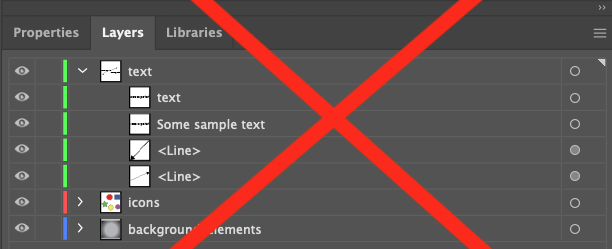

# Creating an Infographiq image {#image_creation}

Infographiq works with vector-based images that are set up in a very specific way. Here we provide instructions for two vector graphics packages: [Adobe Illustrator](https://www.adobe.com/products/illustrator.html) (requires a paid subscription) and [Inkscape](https://inkscape.org/) (free).

You'll also need the example folder for Infographiq, which provides a full working example that you can fiddle around with. We'll be referring to this folder extensively in this guide and you can [download a compressed version here](https://marinebon.org/infographiqJS/infographiq_example.zip). Just unzip the folder when you get it.

You can see the working example [in action here](https://marinebon.org/infographiqJS/infographiq_example/infographic.html).

## Adobe Illustrator {#illustrator}

This guide assumes you have a basic knowledge of using Illustrator ([here is a great series of tutorials](https://helpx.adobe.com/illustrator/tutorials.html)). In particular, you'll need to understand how layers work in Illustrator (and [here's a tutorial](https://helpx.adobe.com/illustrator/using/layers.html) for that).

In the Infographiq example folder, you'll find a file called illustrator_example.ai. Open this file in Illustrator and you'll see the following:

If you check out the Layers tab for the image, you'll see that the image is composed of three layers:

This is the required layer order of an Infographiq image.

**Layers**

1.  text: This first layer is optional and, if present, must be called lower case "text". This layer contains additional explanatory text and graphics for the image that the Infographiq Javascript can toggle on and off. To see this in action, click the "Text in image" button in the upper right of our [Infographiq example](https://marinebon.org/infographiqJS/infographiq_example/infographic.html).

In the Layers panel, we can see that the "text" layer contains several elements:

There are two essential things here:

A. All of the elements are vector-based (nothing pixel-based).

B. None of the elements within this layer are named "text". The following (where one of the elements is named text) is not allowed:

2.  icons. The second layer is required and contains all of the clickable elements in the image. This layer can be named anything, except for "text" or the name of any clickable element in the image.

If you check out the Layers panel for "icons", you'll see that it contains five sublayers (chartexample1 through 5):

Each of these sublayers defines a single clickable component of the image.

-   The names of these sublayers should not contain spaces or be called "text".

-   All elements within the sublayers should be vector-based and not pixel-based.

-   Nothing should overlap on top of anything you want to be clickable.

-   Each sublayer contains all of the elements for a single clickable icon.

-   The elements in the sublayer, if named, should not have the same name as the sublayer itself. So, for example the following won't work (where the element within chartexample1 is also called chartexample1):

3.  background_elements: an optional layer that contains all non-responsive elements of the image. This layer can be called anything (other than "text" or the name of a clickable sublayer). It is ignored by the Infographiq Javascript.

**Saving the image**

To be used by Infographiq, the file must be exported in svg format. To do so:

1.  From the menu, click: File \> Export \> Export As.
2.  In the following screen, select svg format. Be sure to click "Use Artboards".
3.  In the final screen that pops up, be sure to set Object IDs to "Layer Names, as follows:

4.  The default for Illustrator is to add an "01" to your svg file name (so, "example.svg" becomes "example01.svg". Change the file name back to your desired choice.

## Inkscape {#inkscape}

This guide assumes you have a basic knowledge of using Inkscape ([here is a great series of tutorials](https://inkscape.org/learn/tutorials/)). In particular, you'll need to understand how layers work in Inkscape (and [here's a tutorial](https://roy-torley.github.io/Inkscape_Tutorial/Tutorial06/Tutorial06.html) for that).

In the Infographiq example folder, you'll find a file called inkscape_example.svg. Open this file in Inkscape and you'll see the following:

If you check out the Layers palette for the image, you'll see the following:

This is the required layer order of an Inkscape image.

**Layers**

1.  text: This first layer is optional and, if present, must be called lower case "text". This layer contains additional explanatory text and graphics for the image that the Infographiq Javascript can toggle on and off. To see this in action, click the "Text in image" button in the upper right of our [Infographiq example](https://marinebon.org/infographiqJS/infographiq_example/infographic.html). The essential thing here is that all of the elements are vector-based (nothing pixel-based).
