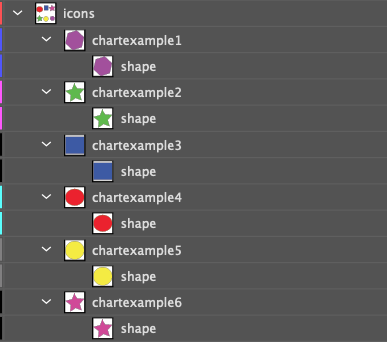

# The link table {#link_table}

The Infographiq method connects a clickable image with scientific data. Infographiq uses a table to know what data is to be associated with what parts of the image. This is shown in the image below (the gray box titled Table in the upper right of the image):

In this section of the guide, we get into how to set up this "link table".

To get started, if you haven't do so already, [download the example folder](https://marinebon.org/infographiqJS/infographiq_example.zip) and unzip it. In the example folder, you'll find a file called "icon_link.csv", which is the link table [used by the example](https://marinebon.org/infographiqJS/infographiq_example/infographic.html). Open icon_link.csv in whatever program you use for looking at tables. The first few lines look as follows:

## Table structure {#table_structure}

1.  The first line of the table must be the column header.

2.  The table must be saved in .csv (comma-separated values) format.

3.  The column order doesn't matter.

4.  Each row refers to a single clickable icon in the image.

5.  The only required column is "icon". All others are optional.

## Table columns {#table_columns}

-   **icon (required):** the name of the layer in the image to be made clickable (the name must exactly match). So, [in the case of the Infographiq example](https://marinebon.org/infographiqJS/infographiq_example/infographic.html), the possibilities would be:

    -   chartexample1

    -   chartexample2

    -   chartexample3

    -   chartexample4

    -   chartexample5

    These are the layer names of the clickable components of the image, as seen in this Layer panel from Adobe Illustrator.

    

-   **svg (optional):** a single link table can be used for multiple Infographiq images. However, if doing so, we need a way to separate out the information for each image, which is what the svg column allows for. All rows to be grouped together as part of the same image should have the same value for svg (the value doesn't have to be the image name).

    If the svg column is absent, then Infographiq will attempt to match all rows in the link table with a given Infographiq image (which is what you would want, if the table only refers to a single image). In the example table icon_link.csv, the only value for this column is "illustrator_example.svg", which is functionally the same as not having the column at all (since all rows will be taken in).

-   **title (optional):** the text that should appear on the image when the mouse is over the clickable element (move the mouse over [the example image](https://marinebon.org/infographiqJS/infographiq_example/infographic.html) to see what this means). If there is no title column, then the name given in the "icon" column will show up on the image instead.

-   **link (optional):** when a clickable element of an image is clicked, Infographiq loads an external HTML file above the image as an `<iframe>` ([more here](https://www.w3schools.com/html/html_iframe.asp) on what an `<iframe>` is). This external HTML file contains the data for the modal window. [Another section of this guide](https://marinebon.org/infographiq/modal-windows.html) goes into detail about the construction of these external HTML files, so we will skip that conversation here.

    For the purposes of this column, all that is needed is the link to the external HTML file, with both relative and absolute links allowed. In the case of the Infographiq example, all of the external HTML files are contained within the example folder, within a subfolder called "modals". It is isn't necessary for a modals subfolder to exist, but we recommend it for ease of organization.

    If the link column is absent, the Infographiq code will assume that the external HTML file is contained in the directory where the Infographiq-containing HTML file is located (so in the Infographiq example, if the link column was missing, the target directory would be "infographiq_example", as that is where "infographic.html" is located). It will further assume that the external HTML file name is the icon name plus ".html" (so, for the first row of icon_link.csv, the assumed HTML file name would be "chartexample1.html").

-   **section (optional):** a method of separating the clickable elements by category. In the demonstration [Example of Infographiq Functionality](https://marinebon.org/infographiqJS/demo.html), if you select either Accordion or Sectioned List under "Text list type", you'll see that the clickable elements are separated by category in the list to the right. The "section" column is what allows this separation to occur, with all icons to be grouped being given the same value for "section". In the [main Infographiq example](https://marinebon.org/infographiqJS/infographiq_example/infographic.html) used in this guide, there are two categories for "section" in the icon_link.csv table: "Category 1" and "Category 2". If the section column is missing from the table, then the Accordion and Sectioned List options are not allowed for "Text list type".

-   **not_modal (optional):** a method for directly linking to an external HTML resource, as opposed to loading it above the image as a modal window. Two values are allowed in this column:

    -   T: link directly to an external HTML resource, based upon the value in the "link" column (not a modal window).

    -   F: external HTML file opens above Infographiq image, based upon the value in the "link" column (modal window).

    For an illustration on how this works, in the [main Infographiq example](https://marinebon.org/infographiqJS/infographiq_example/infographic.html), if you click on the yellow circle, it will take you directly to the main site for the National Oceanic and Atmospheric Administration. The reason that it does so is that, in the relevant row of icon_link.csv (the last row), the value for not_modal is T.

    If the not_modal column is absent, then all external HTML files listed in the link column will open as modal windows above the Infographiq image.
