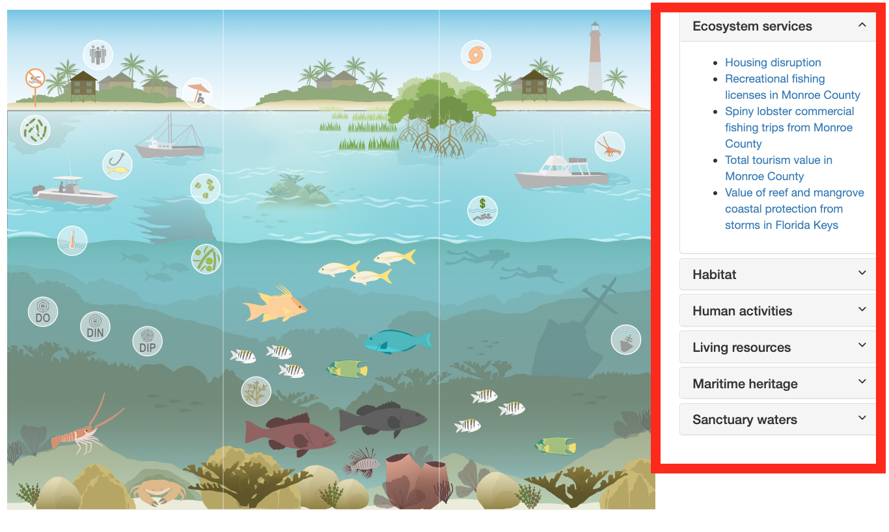

# The InfographiqJS Javascript

The Infographiq method connects a clickable image with scientific data, using a Javascript library called InfographiqJS ([located here](https://marinebon.org/infographiqJS/)) as shown in the image below:

In this section of the guide, we get into how InfographiqJS works to create the clickable image.

Within the InfographiqJS library, there is a function called `link_svg()`: this is the function used to generate the interactive image. You can see many of the options available via `link_svg()` at this [demonstration page](https://marinebon.org/infographiqJS/demo.html).

## Dependencies {#dependencies}

In order for `link_svg()` to work, it relies upon other Javascript and CSS libraries that must be loaded prior to the InfographiqJS Javascript being loaded. These other libraries are known as the **dependencies** for InfographiqJS.

`link_svg` Dependencies:

1.  [jQuery (version 1.9.1)](https://jquery.com/).

2.  [D3 (version 5)](https://d3js.org/).

3.  [Font Awesome (version 4.7)](https://fontawesome.com/).

4.  [Bootstrap (version 3.3.5)](https://getbootstrap.com/docs/3.3/). Note that Bootstrap, which is a framework used for layout, is more of a pseudo-dependency for InfographiqJS. InfographiqJS does not strictly require Bootstrap to run, but we highly recommend its use for layout and our examples have Bootstrap embedded.

## Example {#example}

To get started, if you haven't do so already, [download the example folder](https://marinebon.org/infographiqJS/infographiq_example.zip) and unzip it. In the example folder, you'll find a file called "infographic.html", which you can also see [here](https://marinebon.org/infographiqJS/infographiq_example/infographic.html). Open infographic.html in your handy-dandy code editor. Lines 9-15 in the `<head>` section of the HTML, which read in as follows, load in the dependencies for InfographiqJS.

    
    
    
    <link rel="stylesheet" href="https://maxcdn.bootstrapcdn.com/bootstrap/3.3.5/css/bootstrap.min.css">
    <link rel="stylesheet" href="https://cdnjs.cloudflare.com/ajax/libs/font-awesome/4.7.0/css/font-awesome.css" integrity="sha512-5A8nwdMOWrSz20fDsjczgUidUBR8liPYU+WymTZP1lmY9G6Oc7HlZv156XqnsgNUzTyMefFTcsFH/tnJE/+xBg==" crossorigin="anonymous" />

Lines 31-41 of the HTML are where we load in the InfographiqJS Javascript and CSS. We also call the InfographiqJS function `link_svg()`. This placement is very important: the InfographiqJS Javascript, CSS, and `link_svg()` must show up at the bottom of the `<body>` of the HTML.

    
    <link rel="stylesheet" href="https://marinebon.org/infographiqJS/libs/infographiq_latest/infographiq.css">
    

## Function parameters {#parameters}

There are multiple parameters for the function `link_svg()`, which are detailed here:

-   **svg (required)**: the file path of the infographic image, with both relative and absolute links allowed. The details of how to create the infographic image in a Infographiq-compliant way can be found [elsewhere in this guide](https://marinebon.org/infographiq/image-creation.html). In the example infographic.html, the svg parameter equals "illustrator_example.svg".

-   **csv (required)**: the file path of the link table, with both relative and absolute links allowed. The details of how to create the link table in a Infographiq-compliant way can be found [elsewhere in this guide](https://marinebon.org/infographiq/link-table.html). In the example infographic.html, the csv parameter equals "icon_link.csv".

-   **svg_id (optional)**: the id of the `
` tag in the HTML file where the infographic image should be placed. This parameter defaults to the value 'svg'. In the example infographic.html, the svg_id parameter is set to "svg1", which can be found in the HTML file on line 22.

-   **toc_id (optional)**: the id of the `
` tag in the HTML file where the table of contents should be placed. In the [demo page](https://marinebon.org/infographiqJS/demo.html), the table of contents can be seen to the right of the infographic (the red box in the image below). This image defaults to the value 'toc'. In the example infographic.html, the toc_id parameter is set to "toc1", which can be found in the HTML file on line 25.

    

-   **hover_color (optional)**: the color of the clickable elements in the image when they are selected. Any CSS-compliant color is allowed ([see here for all of the possibilities](https://www.w3schools.com/colors/default.asp)). The default value for hover_color is 'yellow'. To see the effect of changing hover_color, change the value for "Outline color on infographic" in the [demo](https://marinebon.org/infographiqJS/demo.html).

-   **width (optional)**: the width of the infographic image, with a percentage being required. The default value for width is '100%'.

-   **height (optional)**: the height of the infographic image, with a percentage being required. The default value for height is '100%'.

-   **modal_url_pfx (optional)**: a URL prefix to add to the modal window links provided in the [link table](https://marinebon.org/infographiq/link-table.html). An example value for modal_url_pfx would be '<https://www.noaa.gov/fisheries/>'.

-   **toc_style (optional)**: the style of the table of contents. Allowable values are: 'accordion', 'list', 'none', and 'sectioned_list'. The default value is 'list'. To see the effect of changing toc_style, change the value for "Text list type" in the [demo](https://marinebon.org/infographiqJS/demo.html).

-   **colored_sections (optional)**: whether different categories of clickable elements in the infographic should have different hover colors. Allowable values are true and false (note: no quotation marks). The default value is false. If colored_sections is set to true, the hover_color parameter is superseded by the parameter section_colors. This parameter should only be set to true if the "section"column exists in the link table. To see the effect of changing colored_sections, change the value for "Colored section headers" in the [demo](https://marinebon.org/infographiqJS/demo.html).

-   **section_colors (optional)**: the list of colors to be used for different categories of clickable elements. The value expected is an array of [CSS-compliant colors](https://www.w3schools.com/colors/default.asp). The default value for section_colors is ['LightGreen', 'MediumOrchid', 'Orange']. section_colors is only used if colored_sections is set to true. The number of array elements in section_colors does not have to match the number of sections. If there are fewer array elements than sections, then the array elements are repeated over sections. If there are more array elements than sections, the extra array elements are ignored. To see the effect of changing section_colors, change the value for "Colored section headers" in the [demo](https://marinebon.org/infographiqJS/demo.html).

-   **text_toggle (optional)**: the type of text toggle to be displayed above the table of contents. Allowable values are: 'none', 'toggle_off', and 'toggle_on'. The default value is 'none'. To see the effect of changing text_toggle, change the value for "Explanatory text toggle" in the [demo](https://marinebon.org/infographiqJS/demo.html).

-   **svg_filter (optional)**: if the link table contains the data for multiple infographic images, which rows of the link table should be included. This parameter should only be set if the "svg" column exists in the link table. Only rows in the link table where the "svg" column value matches svg_filter will be included.
