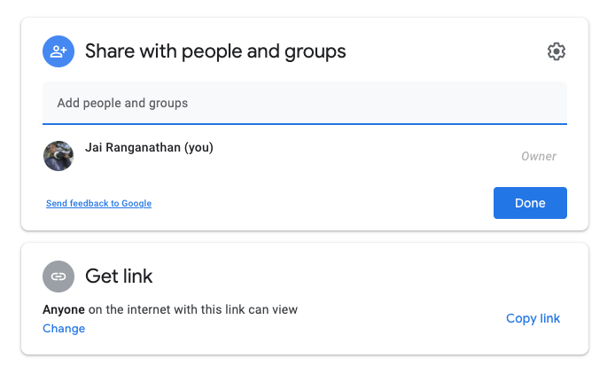

# Modal windows

With the Infographiq method, when a clickable element of an image is clicked, a "modal window" containing data appears on the screen (see image below). To see examples of modal windows in action, check out the [Infographiq demonstration page](https://marinebon.org/infographiqJS/demo.html) and click on any element of the image that highlights.

In this section of the guide, we discuss how to create these modal windows. To get started, if you haven't do so already, [download the example folder](https://marinebon.org/infographiqJS/infographiq_example.zip) and unzip it. In the example folder, you'll find a subfolder called "modals" that contains several HTML files (see image below).

These HTML files provide a range of examples for modal windows.

## What is a modal window? {#what_is}

A modal window is composed of any HTML file. When a clickable element in the image is clicked, the InfographiqJS function `link_svg()` overlays the associated HTML file over the image as an `<iframe>`. The association between clickable elements and HTML files is made in the Infographiq link table (see [the link table section](https://marinebon.org/infographiq/link-table.html) of the guide for more details on table construction).

There are no restrictions on the HTML files that become the modal windows: they can be whatever you want. However, we provide several modal window examples to guide your thinking.

## Example 1: static image {#modal1}

The simplest way to display scientific data is as an image. To demonstrate, in the Infographiq example folder, you'll find a HTML file called "infographic.html" (also [visible here](https://marinebon.org/infographiqJS/infographiq_example/infographic.html)). If you open up infographic.html - and click on the red circle in the picture - a modal window will pop up in which you'll see an image of a line graph.

This modal window exists in the modal subfolder as a HTML file named "modal_image.html". If you open that file in your code editor, here's what the `<body>` looks like:

    

        <h3 style="text-align:center;">A Basic Line Chart Using an Image</h3>
        
         
        This is sample explanatory text about the chart. This is sample explanatory text about the chart. This is sample explanatory text about the chart. This is sample explanatory text about the chart.
    

This HTML is as simple as it can get: just an image and some text.

## Example 2: responsive graph with Highcharts {#modal2}

If you would like to make your display of scientific data something other than a static image, there are many ways to do that. One way is via [Highcharts](https://www.highcharts.com/blog/products/highcharts/), which is a powerful Javascript graphing library. An important note is that, while Highcharts is generally free for non-commercial use, a license is required in all cases. For Highcharts licensing information, [click here](https://shop.highsoft.com/).

In [infographic.html](https://marinebon.org/infographiqJS/infographiq_example/infographic.html), if you click on the blue box, a modal window will pop up in which the line graph is produced via Highcharts. This modal window exists in the modal subfolder as a HTML file named "modal_highcharts.html".

If you open that file in your code editor, you'll see that in the `<head>` the necessary Highcharts Javascripts libraries are loaded and a CSS style is described. In the `<body>`, the container that will hold the Highcharts figure is defined and then the Highcharts function that will generate the figure is run.

This is the simplest possible example of what can be done with Highcharts. Though it is set up to be a template for you to use, there is world more than can be done with Highcharts ([click here](https://www.highcharts.com/demo) to see a gallery of the possibilities). And [here is a complete Highcharts tutorial](https://www.highcharts.com/docs/index).

## Example 3: responsive graph with Google Charts (1 of 2) {#modal3}

Another method of displaying scientific data responsively is with the [Google Charts](https://developers.google.com/chart) Javascript library. Like Highcharts, Google Charts is very powerful (here's a [showcase](https://developers.google.com/chart/interactive/docs/gallery)). Unlike Highcharts, Google Charts is free to use in all cases.

In [infographic.html](https://marinebon.org/infographiqJS/infographiq_example/infographic.html), if you click on the purple hexagon, a modal window will pop up in which the line graph is produced via Google Charts. This modal window exists in the modal subfolder as a HTML file named "modal_google_charts.html".

If you open that file in your code editor, you'll see that in the `<head>` two Google Charts Javascript libraries are loaded. Additionally, several Javascript functions are defined that will create the responsive figure. In the `<body>`, a container is defined on line 69, where the figure created by Google Charts will be positioned.

One thing of note about this figure is that the constituent data comes from a [live Google Sheet](https://docs.google.com/spreadsheets/d/1kb9SPsioe0163b2_xICUp1sOvYGQtBmiLiSkEeW1u-Y/edit#gid=0). You can see this Google Sheet being called in line 22 of modal_google_charts.html. What allows this to work is that, in the sharing options for the Sheet, the "Get link" option is set to "Anyone on the internet can view" (see image below). The sharing options can be accessed by hitting the green Share button in the upper right of the Google Sheet.

As with the Highcharts example, this modal window is a very simple example of what can be done with Google Charts. This window is a template for you to use and modify, but do check out the [Google Charts gallery](https://developers.google.com/chart/interactive/docs/gallery) to get more ideas. And here is a [complete Google Charts tutorial](https://developers.google.com/chart/interactive/docs).

## Example 4: responsive graph with Google Charts (2 of 2)

We provide a slight variant on creating responsive line charts with Google Charts. In [infographic.html](https://marinebon.org/infographiqJS/infographiq_example/infographic.html), if you click on the green star, a modal window will pop up in which the Google Charts-created graph contains a labeled blue bar over part of the x-axis. This modal window exists in the modal subfolder as a HTML file named "modal_google_charts2.html".

Creating a highlighted interval over the x-axis is not part of the core Google Charts functionality, so we created a Javascript library to add this feature (among others). This library can be found at [plotJS-extra](https://github.com/noaa-iea/plotJS-extra).

The plotJS-extra function `GraphWrapper()`, which generates the highlighted x-axis interval, is called on lines 14-22 of modal_google_charts2.html. The parameters for `GraphWrapper()` are described [here](https://github.com/noaa-iea/plotJS-extra/blob/main/README.md).
