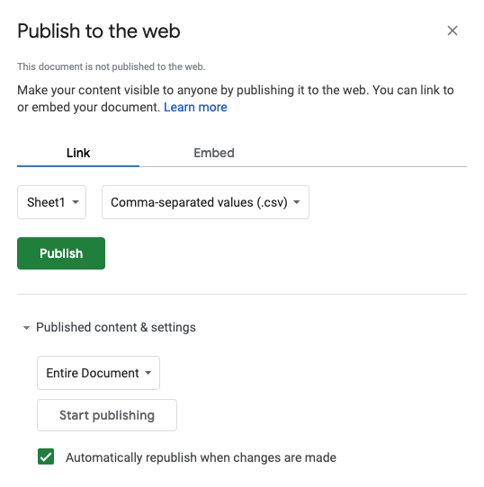

# Responsive data tables

The InfographiqJS Javascript library ([located here](https://marinebon.org/infographiqJS/)) can create responsive data tables. For an example of this functionality, open [this demonstration page](https://marinebon.org/infographiqJS/table_modalv1.html) and click on any row to display the associated figure.

In this section of the guide, we discuss how InfographiqJS works to create this kind of responsive data table. Within the InfographiqJS library, there is a function called `link_table()`: this is the function used to generate the responsive data table.

## Dependencies {#dependencies}

In order for `link_table()` to work, it relies upon other Javascript and CSS libraries that must be loaded prior to the InfographiqJS Javascript being loaded. These other libraries are known as the **dependencies** for InfographiqJS.

`link_table()` Dependencies:

1.  [jQuery (version 3.6.0)](https://jquery.com/).

2.  [D3 (version 5)](https://d3js.org/).

3.  [DataTables (version 1.10)](https://datatables.net/).

4.  [Font Awesome (version 4.7)](https://fontawesome.com/).

## Function parameter {#parameters}

There is one parameter for `link_table()` and it is required:

-   `csvLink`: URL of data (saved in csv format) to be displayed as a responsive table. The URL must be given as a absolute file path (meaning, for example, `https://www.noaa.gov/example.csv` not `example.csv`). The data in csv file needs to be set up in a very particular way and we go into it further down on this page.

## How `link_table()` works {#how_works}

The `link_table()` approach to displaying modal windows differs from that taken by `link_svg()` - the latter being the InfographiqJS function used to create clickable infographics. The simplest way to explain `link_table()` is to walk through the `<body>` of the HTML of the [demonstration page](https://marinebon.org/infographiqJS/table_modalv1.html).

``` {.html}
<h1>Table</h1>
<table id="example" class = "display" width="100%" style = "cursor: pointer;"></table>
```

First off, we title the page and define an empty `<table>` container. `link_table()` will position the responsive table here.

``` {.html}
<div id="modal1" class="modal" >
  <div class="modal-content animate" >
    <div class = "container">
      <h3 style = "text-align: center;"><span id="title"></span></h3>
      <div id="img_target" ></div>
      <span id="caption"></span>
      <span id="datalink"></span>
      <span id="methodslink"></span>
    </div>
    <div class="container" >
      <button type="button"  onclick="document.getElementById('modal1').style.display='none'" class="closebtn">CLOSE</button>
    </div>
  </div>
</div>
```

Next, we define another empty container called "modal1". This container is not visible when the page is first loaded, but will be used display the modal content. When the user clicks on a given row, `link_table()` fills in the modal container with the relevant content (based on data in that row) and then makes the container visible. When the user clicks out of the modal container, `link_table()` makes that container invisible again.

``` {.html}
<script src="https://code.jquery.com/jquery-3.6.0.min.js"
  integrity="sha256-/xUj+3OJU5yExlq6GSYGSHk7tPXikynS7ogEvDej/m4="
  crossorigin="anonymous"></script>
<script src="https://d3js.org/d3.v5.min.js"></script>
<script src="https://cdn.datatables.net/1.10.24/js/jquery.dataTables.min.js"></script>
<link rel="stylesheet" href="https://cdn.datatables.net/1.10.24/css/jquery.dataTables.min.css">
<link rel="stylesheet" href="https://cdnjs.cloudflare.com/ajax/libs/font-awesome/4.7.0/css/font-awesome.css" 
  integrity="sha512-5A8nwdMOWrSz20fDsjczgUidUBR8liPYU+WymTZP1lmY9G6Oc7HlZv156XqnsgNUzTyMefFTcsFH/tnJE/+xBg==" 
  crossorigin="anonymous" />
<script src='https://marinebon.org/infographiqJS/libs/infographiq_latest/infographiq.js'></script>
<link rel="stylesheet" href="https://marinebon.org/infographiqJS/libs/infographiq_latest/infographiq_table.css"> 
<script>
    var csvLink1 = "https://docs.google.com/spreadsheets/d/e/2PACX-1vS3WnWFSuZA3I6d16n9bJo33cd_3mL6_XVIf1CRbKzJM6NvLKs6B39-m6jfRfZyFr2lxGQ7dcN0MWxl/pub?gid=0&single=true&output=csv";
    link_table(csvLink1);
</script>
```

Lastly, we load the relevant Javascript/CSS libraries and run the function `link_table()`.

## Data structure {#data}

The data loaded into `link_table()` via the function parameter `csvLink` needs to be set up in a very specific way. To see the data structure, please see [the following Google Sheet](https://docs.google.com/spreadsheets/d/1JeyhWEPBGeO_vi9gPSrB8rgKMHzS7RaZ_VHo5JcP7VA/edit#gid=0).

1.  The first line of the table must be the column header.

2.  The table must be saved in .csv (comma-separated values) format.

3.  The column order matters (meaning, keep the column order in the Google Sheet) .

**Table columns (all required)**

-   **EPU**: Ecological Production Unit (shown in responsive table only).

-   **indicator_name**: Indicator Name is displayed in the responsive table and as the title of the modal window.

-   **indicator_chunk_title**: not used in either the responsive table or the modal window.

-   **image_url**: the link to the Github page for an image of a figure (modal window only).

-   **caption**: the caption to the figure (modal window only).

-   **alt_text**: text description of figure image (modal window only).

-   **data_link**: URL of data source for figure (modal window only).

-   **time_min**: the year that data collection began for the figure (responsive table only).

-   **time_max**: the year that data collection ended for the figure (responsive table only).

-   **methods_link**: URL for description of methods used for figure creation (modal window only).

## Data table location {#csv_location}

Where to save the data table used to generate the responsive table? The simplest answer would be to just save the data table, in csv-delimited format, in a location where it can be accessed via URL.

Another option though would be to save the data table as a Google Sheet. In fact, that is exactly where the data table for the demonstration page lives. If you observe the demonstration page HTML below, you'll see that the variable `csvLink1` links to a Google Sheet ([the very same Google Sheet](https://docs.google.com/spreadsheets/d/1JeyhWEPBGeO_vi9gPSrB8rgKMHzS7RaZ_VHo5JcP7VA/edit#gid=0) mentioned earlier on this page).

``` {.html}
<script>
    var csvLink1 = "https://docs.google.com/spreadsheets/d/e/2PACX-1vS3WnWFSuZA3I6d16n9bJo33cd_3mL6_XVIf1CRbKzJM6NvLKs6B39-m6jfRfZyFr2lxGQ7dcN0MWxl/pub?gid=0&single=true&output=csv";
    link_table(csvLink1);
</script>
```

The reason this can work is that Google Sheets allows for the publishing of data as a URL-accessible and csv-delimited file. Here's how to do that. While in the target Google Sheet, click File \> "Publish to the web".

{width="303"}

In the window that pops up (see image below):

1.  Select "Link".

2.  Select the relevant sheet.

3.  Select "comma-separated values".

4.  Click "Published content & settings" to ensure that the settings look something like the image below.

5.  Hit the green Publish button.

6.  A URL will appear in the window in a text box. This URL is the link to the csv-version of the google sheet. Save this URL and use it as the value for the variable `csvLink1`.

{width="415"}

This approach will only work if your version of Google Sheets allows you to share it outside of your organization. Take a look at the bottom of your "Publish to the web" window (see below). If you are unable to unclick the "Restrict access to the following" checkbox, this Google Sheets method of saving the data won't work for you.

{width="415"}
